This appears to be a skiing game written in TI BASIC (Texas Instruments BASIC), likely for the TI-99/4A home computer from the early 1980s.

1. Basic Structure:
- The program creates a skiing simulation where 1-9 players can compete
- Players navigate through a procedurally generated ski course using a joystick
- It includes multiple game modes: Downhill (Abfahrt), Giant Slalom (Riesenslalom), and Slalom

2. Technical Features:
- Uses sprite graphics for the skier character
- Implements collision detection with gates/obstacles
- Includes sound effects for various events
- Has timing mechanisms to track player performance
- Creates procedurally generated courses based on a seed number (PSN)

3. Interesting Design Elements:
- The game can handle multiple players with name entry
- Different difficulty levels through the three skiing modes
- Records and displays rankings
- Includes jumping mechanics (indicated by the JUMP variable)
- Has a title screen with animated text
- Uses character graphics for course elements

4. Game Logic:
- Players must navigate through gates
- Hitting or missing gates results in time penalties
- The course is dynamically drawn as the player progresses
- Times are tracked and compared for rankings
- Includes features like course selection and difficulty options

The code is quite sophisticated for its time, using various TI-99/4A specific commands like CALL CHAR (for defining custom characters), CALL SPRITE (for sprite management), and CALL SOUND (for sound effects). The game even includes features like course number selection, allowing players to challenge each other on the same course layout.

```mermaid
flowchart TD
    Start[500: Program Start] --> Init[500-670: Initialize Variables & Characters]
    Init --> Title[2570-2750: Display Title Screen & Rules]
    Title --> NumPlayers[680-690: Get Number of Players]
    
    NumPlayers --> IsMulti{690: Multiple Players?}
    IsMulti -->|Yes| Names[710-760: Enter Player Names]
    IsMulti -->|No| Course
    Names --> Course[770-780: Select Course Number]
    
    Course --> GameMode[790-800: Select Game Mode]
    GameMode --> GM{830: Mode Selection}
    GM -->|1| Downhill[840-850: Set Downhill Parameters]
    GM -->|2| Giant[860-870: Set Giant Slalom Parameters]
    GM -->|3| Slalom[880: Set Slalom Parameters]
    
    Downhill & Giant & Slalom --> GenCourse[970-1060: Generate Course]
    
    GenCourse --> PlayerLoop[1120-1130: Player Turn Loop]
    
    PlayerLoop --> GameLoop[1300-1900: Main Game Loop]
    
    GameLoop --> Controls[2230-2280: Process Joystick Input]
    Controls --> Physics[1340-1380: Update Position]
    Physics --> Collision[1460-1470: Check Collisions]
    
    Collision --> HasCollision{1470-1500: Hit Something?}
    HasCollision -->|Yes| Penalty[1520-1670: Apply Time Penalty]
    HasCollision -->|No| CheckFinish
    Penalty --> CheckFinish
    
    CheckFinish{1490: Reached Finish?} -->|No| GameLoop
    CheckFinish -->|Yes| SaveScore[1910: Save Player Time]
    
    SaveScore --> UpdateRank[2300-2400: Update Rankings]
    
    UpdateRank --> MorePlayers{2150: More Players?}
    MorePlayers -->|Yes| PlayerLoop
    MorePlayers -->|No| ShowResults[2410-2550: Display Final Results]
    
    ShowResults --> PlayAgain{2160-2200: Play Again?}
    PlayAgain -->|Yes| NumPlayers
    PlayAgain -->|No| End[2210: End Program]
    
    subgraph "Collision Types"
        direction LR
        Gate[1520-1560: Gate Collision]
        Jump[1671-1679: Jump Pad]
        Wall[1570-1670: Wall Collision]
        OutOfBounds[1680-1770: Out of Bounds]
    end
    
    subgraph "Game Parameters by Mode"
        direction LR
        F1[Speed Factor:<br>3 Downhill<br>4 Giant Slalom<br>5 Slalom]
        F2[Gate Spacing Min:<br>8 Downhill<br>7 Giant Slalom<br>3 Slalom]
        F3[Gate Spacing Random:<br>8 Downhill<br>7 Giant Slalom<br>3 Slalom]
        F4[Course Difficulty:<br>12 Downhill<br>16 Giant Slalom<br>24 Slalom]
        F5[Time Penalty:<br>1.0 Downhill<br>0.5 Giant Slalom<br>2.0 Slalom]
    end
```

