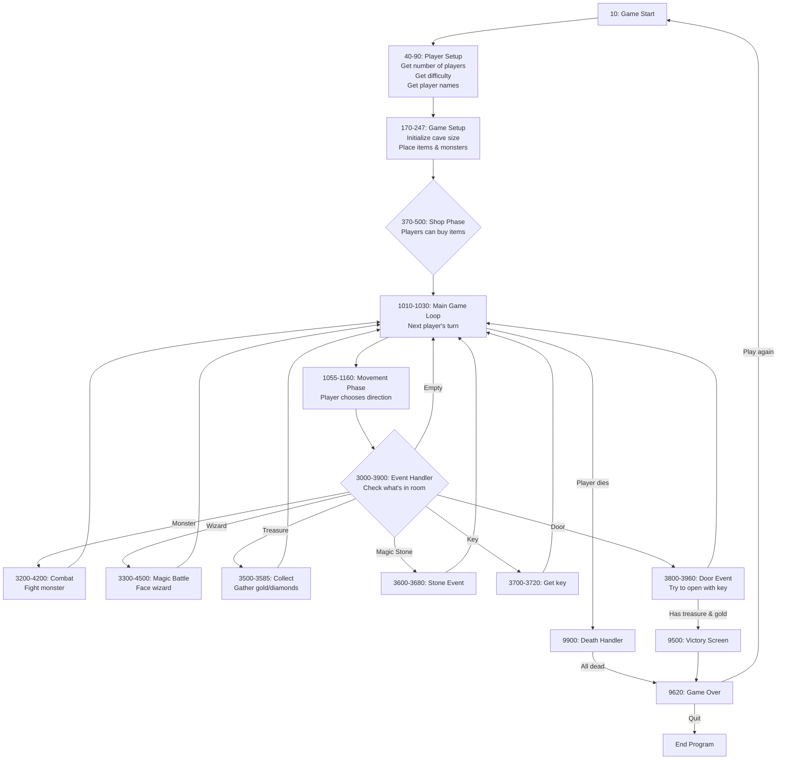

This appears to be a BASIC program (likely TI-BASIC based on the syntax) for a text-based dungeon crawler/adventure game.

The game features:
1. Multiple players (1-6) can play
2. Three difficulty levels
3. Players navigate through caves/dungles numbered 1 to HL (where HL varies by difficulty)
4. Players can collect gold, fight monsters, use items, and cast spells
5. The ultimate goal appears to be finding and unlocking the "Dragon of Mordor's treasure"
6. Health system (VV array tracks player health)
7. Various items like healing potions, teleport spells, magic stones
8. Combat system with monsters and wizards
9. Shop system where players can buy items

Some interesting features I notice:
1. The game has a sophisticated economy system with gold that can be collected and spent
2. There's a magical key system (line 3700) where players need to remember a specific number (K1) to open the final door
3. The health system is percentage-based (0-10)
4. Combat has different systems for monsters vs wizards
5. The game features multiplayer where players can help or hinder each other with spells and items
6. There's a "Shop Phase" at the start where players can buy equipment
7. The game uses sprites for some visual elements (lines 10000+)
8. Players can die from over-exertion (carrying too much gold) or from combat