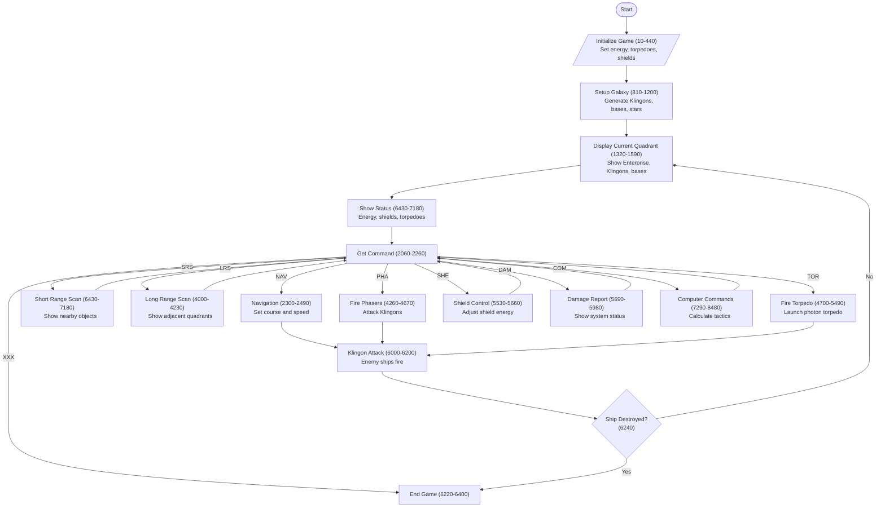

This appears to be a BASIC implementation of the classic Star Trek text game from the 1970s, specifically written in TI BASIC (for Texas Instruments computers) based on the syntax. It's a space combat simulation where players command the USS Enterprise and battle Klingon ships across different quadrants of space.

Key observations about the code:

1. Game Structure:
- Uses a quadrant-based space system (8x8 grid of quadrants)
- Each quadrant contains a sector grid (also 8x8)
- Features multiple enemy Klingon ships, starbases, and stars

2. Core Game Mechanics:
- Energy management system (shields vs weapons vs movement)
- Multiple weapon systems (phasers and photon torpedoes)
- Damage control system affecting ship's capabilities
- Navigation between sectors and quadrants

3. Interesting Technical Aspects:
- Uses single-letter variables (common in BASIC to save memory)
- Extensive use of GOSUB for subroutines
- Creative use of string manipulation for display
- Uses a coordinate system with both quadrant and sector positions

4. Command System:
- NAV: Navigation control
- SRS: Short Range Scan
- LRS: Long Range Scan
- PHA: Phaser control
- TOR: Photon torpedo control
- SHE: Shield control
- DAM: Damage report
- COM: Computer functions
- XXX: End game

The game was quite sophisticated for its time, featuring strategic elements like resource management (energy, shields, torpedoes), tactical combat, and exploration elements. It's particularly impressive considering the limited computing resources available when it was created.